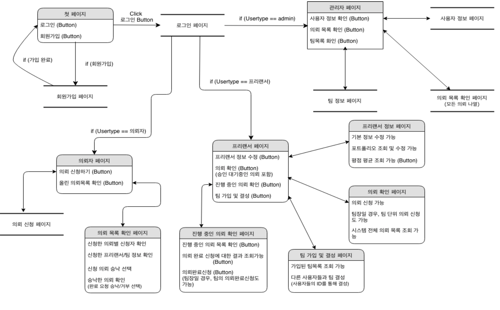

# outsourcing-broker
2018-2 Yonsei Univ. Database Project. Mostly worked on freelancer part. We got a perfect score.

## Introduction

You need to implement a system that allows website administrator, freelancers, and clients to manage, request, accept, and evaluate requests through a simple UI. In order to achieve this goal, the system must specifically satisfy the following conditions.

- The system manages the data needed at the site through an RDBMS and must be able to communicate with the database server over the network.
- The system must have a user login feature. The system administrator account is unique and pre-registered. Freelancers and clients should be able to join through the subscription system.
- The system manages the data and provides statistical data tailored to the user.

## Specifications

- Administrator should be able to log in with a predefined username and password.
- Users (freelancers, clients) should be able to join the system. When signing up, they should enter the appropriate information for each.
- The administrator can check user account information, request list, team list, rejected request and completed request list of the system and delete them.
- The freelancer should be able to modify his information, allowing him to check his system's internal portfolio and upload his external portfolio.
- The freelancer should be able to see the list of requests currently being hired. The list of requests should be sorted in order of the start date and commission amount.
- The freelancer can send a request to complete a request for an ongoing request.
- The freelancer should be able to see a list of ongoing requests and brief information.
- The freelancer can evaluate the client's rating when the request is completed (when the client accepts the request for completion).
- The client may post a request. Referrals should include appropriate information.
- The client should be able to check the list of ongoing requests. This list should be sorted in order of development start time, commission amount.
- The client can click on the list of requests to see a list of freelancer who applied for the request. The list should include information about the freelancer's career, proficiency in each programming language, ratings, and portfolio. After that, the client can select the freelancer.
- The client should be able to confirm the request for completion. The client may accept or reject the request for completion. When accepting, the freelancer is rated.
- The client may reject the request to complete the request, and the message is sent to the freelancer.
- When the freelancer is rejected, the freelancer can check the reason for rejection and can request the completion of the request again.

## System Flow Chart

